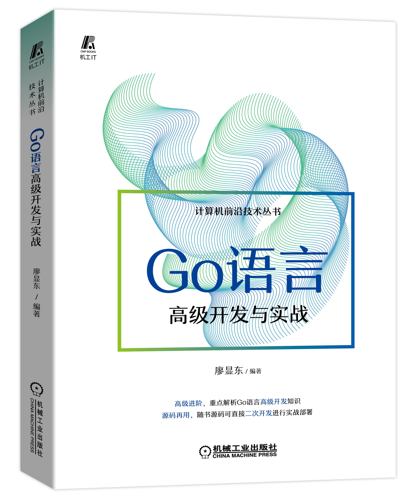

#  🔥🔥紧跟技术潮流，先人一步学好Go语言！
#  🔥🔥Go语言这么火，再不学Go语言，你就Out了！一起学习挑战30天拿到高薪offer！！
####  先看看拉钩上Go语言薪资，你心动吗？心动就一起学习Go语言吧～

# 《Go语言高级开发与实战》源码说明
####  （1）作者历时1年多编写的代码免费开源啦！ 
####  （2）代码采用目前go最新版本编写。 
####  （3）所有的代码都是经过反复测试过，精益求精，下载下来即可运行！
####  （4）实例代码是绝大部分都是来自于最新的企业实战项目。
####  当当（🔥🔥🔥🔥🔥🔥 活动抢购中......）：http://product.dangdang.com/29359572.html
####  京东（🔥🔥🔥🔥🔥🔥 活动抢购中......）：https://item.jd.com/13594166.html

 

#  零基础入门， 突出高级实战！高级实战！高级实战！干货如下：
####  系统学习Go语言基础知识；
####  掌握Go语言基础类型的方法和技巧；
####  掌握Go 模块管理方法和技巧；
####  掌握函数与指针技巧；
####  掌握反射应用技巧； 
####  掌握Go 编译原理；
####  掌握CGO 编程技巧；
####  掌握错误和异常处理技巧；
####  掌握密码学算法技巧；
####  掌握Go 设计模式实战技巧；
####  掌握HTTP基本原理；
####  掌握Go Web 原理；
####  掌握Go HTTP3 编程技巧；
####  掌握Go访问MySQL方法和技巧；
####  掌握Go访问Redis方法和技巧；
####  掌握Gorm的使用方法和技巧；
####  掌握Beego ORM的使用方法和技巧；
####  掌握Go Socket编程的方法和技巧；
####  掌握用gRPC实现微服务调用；
####  掌握从数据库中导出一个CSV文件的实战法；
####  掌握Go并发编程的底层原理
####  掌握常见Go并发Web应用的实战开发方法和技巧
####  掌握Go开发分布式系统的方法和技巧
####  掌握Go开发分布式爬虫的方法和技巧
####  掌握Go语言开发的秒杀系统开发的整个流程方案及源码；

#  本书聚焦Go语言高级开发的知识进行全面深入地讲解。本书有如下特色：
##  （1）一线技术，突出实战；
####  本书以实战为核心，贯穿整本书。所有代码采用Go最新版本（1.16.2）编写。
##  （2）零基础入门，循序渐进，实现快速从菜鸟向实战派高手迈进；
####  本书初、中、高级程序员都可以从书中学到干货。先从Go的基础学起，然后学习Go核心的技术，再学Go的高级应用，然后再进行项目实战。全书从最基础的知识讲解一步一步到最核心的秒杀系统实战开发，真正帮助读者从基础向开发实战高手迈进。
##  （3）极客思维，极致效率；
####  本书以极客思维、深入Go语言底层进行探究，帮助读者了解背后原理。全书言简意赅，以帮助读者提升开发效率为导向，同时尽可能帮助读者缩短阅读本书的时间。
##  （4）由易到难，重难点标注并重点解析；
####  本书编排由易到难，内容基本覆盖Go 语言高级开发的主流前沿技术。同时对重难点进行重点讲解，对易错点和注意点进行了提示说明，帮助读者克服学习过程中的困难。
##  （5）突出实战，快速突击；
####  本书的实例代码是绝大部分都是来自于最新的企业实战项目。对于购买本书的读者，所有的源代码均可以通过网上下载，直接下载即可运行，让读者通过实践来加深理解。
##  （6）实战方案，可直接二次开发进行实战部署；
####  本书全书以实战为主，所有的示例代码，拿来即可运行。特别是第7章，购买本书的读者可以直接获得秒杀系统的全部源代码。读者购买本书不仅可以学习本书的各种知识，也相当于购买一个最新版的Go语言秒杀系统解决方案及项目源码。

# 技术交流与反馈
假如读者在阅读本书的过程中有任何疑问，请用手机微信扫描下方二维码，

关注“源码大数据”公众号，输入读者遇到的问题，作者会第一时间与读者进行交流回复。

读者也可以添加QQ:823923263进行交流反馈。

尽管作者在本书写作过程中尽可能地保持严谨，但难免有纰漏之处，欢迎读者通过“源码大数据”公众号或者QQ群等方式批评指正。

注意：本仓库不包含秒杀项目，要获取秒杀项目源码，请购买本书通过前言的说明获取。
